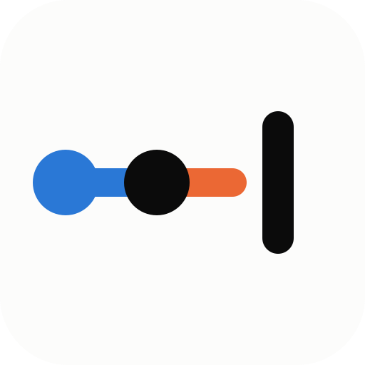

# Safety dependencies

**What still blocks attacks carried out with AI, who holds it, and since when.**

What stops an AI agent from doing damage is often not in your code. It is a provider closing an account, a lab keeping a model under lock, a human reviewing code before accepting it. **These defenses belong to others, and nobody warns you when they give way.** This repository lists them, dated, with their sources.

## Start here

| | |
|---|---|
| 📖 **Understand it in 15 minutes** | Read the article: [English](https://airiskpath.org/article) · [Français](https://airiskpath.org/fr/article) |
| 🔎 **See what still holds** | Browse the list below, or the full entries in [`list/`](list/) |
| ✋ **A defense just gave way?** | [Tell us, with your source](../../issues/new?template=state-update.yml) — it takes two minutes |
| ➕ **Know a defense we missed?** | [Propose a new entry](../../issues/new?template=new-entry.yml) |
| 🧮 **Check our numbers** | `cd trend && make tendance` — one command, same figures. See [`trend/`](trend/) |

## The list, as of 26 September 2026

| Family | The defense | Who holds it | State |
|---|---|---|---|
| Capability | Application workflows still slow down agents trying to extend a foothold across a corporate network | The labs | 🟢 holds |
| Capability | The long chain of steps in a simulated corporate attack scenario | The labs | 🔴 lifted in April |
| Capability | A simulated industrial network, where the stake is disrupting a physical process | The labs | 🔴 lifted in May |
| Access | Access controls reserved for trusted users, against help with chemical or biological weapons *(source: the provider itself)* | The provider | 🟢 holds |
| Installed control | Account termination by the provider, which ended observed intrusion and espionage operations *(source: the provider itself)* | Model providers | 🟢 holds |
| Duration | Nobody has measured whether an agent can run a long operation undetected | Evaluators | ⚪ not tested |
| Tacit knowledge | Gaps in specialist knowledge, still listed among model failures, already partly overcome | Not specified by the source | ⚪ not tested |
| Identity | No published evaluation shows an identity, payment or account requirement blocking an agent | Banks, payment rails, compute providers | ⚪ not tested |
| Resource | No evaluation shows compute or money as a limit; more compute buys more steps, no plateau observed | Compute providers | ⚪ not tested |
| Not tested | Nobody has measured an autonomous attack against an actively defended network | Evaluators | ⚪ not tested |
| Not tested | The behaviours of the most dangerous actors are missing from the standard attack framework | MITRE, evaluators | ⚪ not tested |

**The most frequent answer is "not tested": nobody has checked.** Nobody else publishes that, and it is the most useful line in the list. Lifted locks stay in: a list that shows what has just fallen says more than one that erases it.

## What this is not

No probabilities, no forecasts, no clock. We publish what has already been observed, and what still holds. **We never publish a way through a defense**: an entry names what blocks, never how to get around it.

## More

- Rules for contributions: [CONTRIBUTING.md](CONTRIBUTING.md). We answer within 48 hours during the first month.
- Method, including a pre-registered negative result: [doi:10.5281/zenodo.22893444](https://doi.org/10.5281/zenodo.22893444).
- Licences: the list is [CC BY 4.0](list/LICENSE.md), the code is [MIT](LICENSE).
- Author: [Franck Bardol](https://bardol.org), with the help of AI agents · [airiskpath.org](https://airiskpath.org) · contact@airiskpath.org
